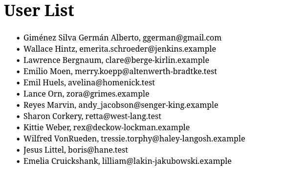

# ⚛️ React Frontend – Rails API Consumer

This is a simple **React application** that fetches and displays user data from a **Ruby on Rails API**.

The backend Rails server is expected to be running separately on `http://localhost:3001`.

## 📦 Features

- Fetches user data from `/api/v1/users`
- Displays user names in a list
- Handles loading and error states
- Ready to run in a Docker container or standard React environment

## 🛠️ Getting Started

### Prerequisites

Make sure the Rails API is running at `http://localhost:3001` and has CORS enabled for `http://localhost:3000`.

### Installation

```bash
npm install
```

2. Install dependencies

```bash
npm install
```

3. Run the app (assumes backend is already running)

```bash
npm start
```


The app will be available at http://localhost:3000.

⚙️ API Endpoint Assumptions
This React frontend expects a Rails API running locally at:


http://localhost:3001/api/v1/users
Make sure CORS is enabled in your Rails backend:

Example CORS config in config/initializers/cors.rb:

Rails.application.config.middleware.insert_before 0, Rack::Cors do
  allow do
    origins 'http://localhost:3000'
    resource '*',
      headers: :any,
      methods: [:get, :post, :put, :patch, :delete, :options, :head]
  end
end

🧱 Stack
React (Create React App)

JavaScript (ES6+)

Fetch API

Docker-friendly setup

Ruby on Rails (API only, running separately)

📦 Live Demo
Want to try this on your machine?
Set up a simple Rails API that returns a list of users at /api/v1/users and run this React app alongside it.

🤝 Let's Work Together
Do you want to build a new Rails app with a modern React frontend?
Or improve your existing application?

📬 Contact me here

📸 Preview



📜 License
This project is open source and available under the MIT License.

Made with ❤️ using


Feel free to copy and paste this block directly into your GitHub repository's `README.md`. Let me know if you need any adjustments or additions!
